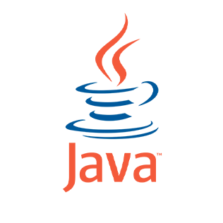

### Hello my name is Marko Stojanovikj  

I am a student, right now I am learning Java  

🌎 I live in Skopje, Macedonia  
📕 I have experience programing in these languages:  
 Java  
C++ 
C  

<!--

-->

<!--
**sm791600/sm791600** is a ✨ _special_ ✨ repository because its `README.md` (this file) appears on your GitHub profile.

Here are some ideas to get you started:

- 🔭 I’m currently working on ...
- 🌱 I’m currently learning ...
- 👯 I’m looking to collaborate on ...
- 🤔 I’m looking for help with ...
- 💬 Ask me about ...
- 📫 How to reach me: ...
- 😄 Pronouns: ...
- ⚡ Fun fact: ...
-->
